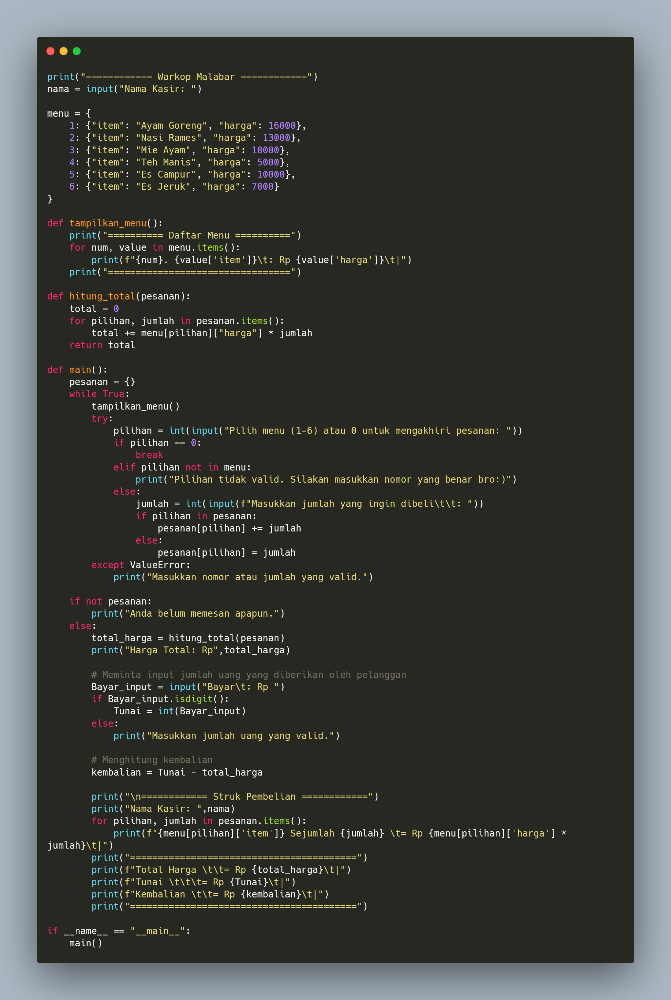
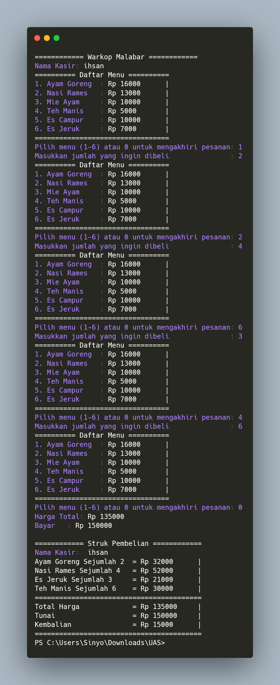
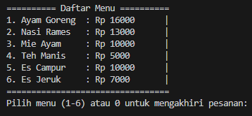
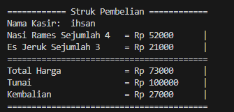

 # Project UAS

## Profil
| Variabel | Isi |
| ---------- | --- |
| **Nim** | 312310494 | 
| **Nama** | IHSAN RANGGA MAHENDRA |
| **Kelas** | TI.23.A5 |
| **Dosen** | Agung Nugroho,S.Kom.,M.Kom |
| **Mata Kuliah** | Bahasa Pemrograman |
| **Link YOUTUBE** | https://youtu.be/SAHCBhOryLc?si=U9ttfo1-fAV-bHpI |

### Project UAS Bahasa Pemrograman 

*Buatlah Program Kasir di sebuah kantin, dengan kondisi berikut:*
- List opsi pilihan makanan/minuman dan aksi, bisa menggunakan
- format dictionary
- program harus meminta input pilihan makanan dari pengguna.
- program harus menghitung total harga makanan yang dipesan.
- program harus menampilkan struk pembelian

## kode program Kasir

## Output program

### Masukan Tabel Menu

## Mencetak struk
